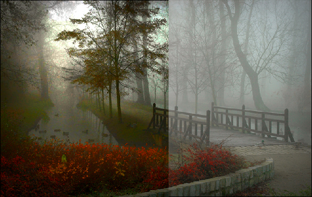

[](https://www.python.org/)

# Morning view mode
My final Project for my Digital Image Course

### Abstract
The removal of haze has applications in consumer/computation photography and computer vision. The main focus of the project is to implement the Dark Prior Haze removal method. The main idea of the Dark channel prior method is the assumption has haze will have similar intensity in the entire three different color channels. This assumption bound the application of the algorithm too only outdoors images and bright images. The method also assumes that haze is only absorbed and scatter the light in an image. This assumption allows us to reconstruct a haze- free image by only knowing the ambiance of the image. One can use the information present in the dark before finding a good estimate of the ambiance. The paper had implemented, the Laplace matrix or soft matting was used to preserve edge information. In our implementation, we are using the guided filter to refine the transmission map and perform the edge preservation. The algorithm was successful to implement and apply the algorithm on 10 different images. The resulting image has a significant decrease in brightness, which not significant for a bright image

### How to setup
```
pip install -r requirements.txt
```

## Results


### Resources

[Dark Prior Paper](http://kaiminghe.com/publications/cvpr09.pdf)
